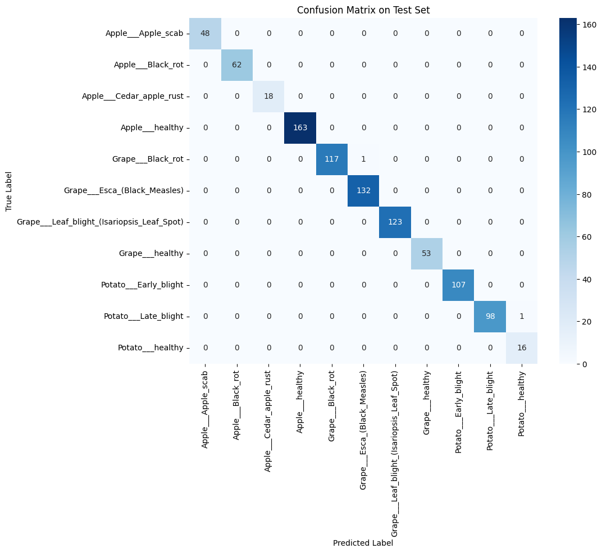
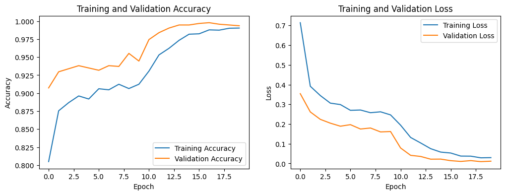

# CNN-LLM: Explainable Plant Leaf Disease Diagnosis 🌿🤖

[](https://llm-explain.streamlit.app/)
[](#)
[](#)
[](#license)
[](#contributing)

> **TL;DR**: This project combines a **CNN (EfficientNetV2-RW-M)** for leaf disease classification with a **Large Language Model (GPT-4o via Replicate)** to generate **human-readable explanations** grounded in class-specific symptom knowledge. A live demo is available on **Streamlit**: **https://llm-explain.streamlit.app/**

---

## ✨ Key Features

- **Leaf Image Classification (CNN)** – Fine-tuned **EfficientNetV2-RW-M** (via `timm`), trained on a curated subset of PlantVillage (Apple / Grape / Potato).
- **Automatic Textual Explanation (LLM)** – **`openai/gpt-4o` via Replicate** with a structured prompt and a domain knowledge module **`disease_info.py`** (symptoms, distinguishing features, early actions).
- **Accuracy + Interpretability** – Each prediction comes with a confidence score and an explanation of *why* the image is assigned to a particular class.
- **Interactive Web App** – **Streamlit** interface for image upload ➜ CNN diagnosis ➜ LLM explanation.

---

## 🚀 Live Demo

- **App URL**: **https://llm-explain.streamlit.app/**
- **How it works**:
  1. Upload a leaf image (Apple, Grape, or Potato).
  2. The CNN predicts the disease class and confidence.
  3. GPT-4o generates a concise explanation and early recommendations.

---

## 🧠 Architecture Overview

```text
[Leaf Image]
      │
      ▼
Preprocessing (Resize / Normalize)
      │
      ▼
EfficientNetV2-RW-M  ──►  predicted label + confidence
      │
      │    ┌────────────────────────────────────────────────────────────┐
      └──► │  disease_info[label] + Structured Prompt + GPT-4o (LLM)    │
           └────────────────────────────────────────────────────────────┘
                              │
                              ▼
                Explanation text (disease description + rationale)
```

- **CNN**: EfficientNetV2-RW-M backbone with a single linear classification head for 11 classes.
- **Knowledge base**: `disease_info.py` stores class-specific symptoms, distinguishing features, and early actions.
- **LLM**: GPT-4o (served via Replicate) conditions on the CNN label, confidence, and knowledge base entries to produce explanations.

---

## ⚙️ Quick Local Setup

> **Model weights**: `*.pth` files are tracked with **Git LFS** (~200MB+). Make sure Git LFS is installed so model weights are downloaded correctly.

```bash
git clone https://github.com/frenskuy/CNN-LLM.git
cd CNN-LLM

python -m venv .venv
# Windows
.venv\Scriptsctivate
# macOS/Linux
source .venv/bin/activate

pip install --upgrade pip
pip install -r requirements.txt

git lfs install
git lfs pull

streamlit run app.py
```

### Required Environment

- `REPLICATE_API_TOKEN` → API token for using the `openai/gpt-4o` model on Replicate.  
  - Locally: set as an environment variable or via a `.env` file.  
  - Streamlit Cloud: store it under **Secrets**.
- Device (`cuda` / `cpu`) is chosen automatically via:
  ```python
  torch.device("cuda" if torch.cuda.is_available() else "cpu")
  ```

---

## 📈 Results (Classification Report)

> Summary of model performance on the **held-out test set (939 images)**, reported in the same format as `sklearn.metrics.classification_report`.

```text
Classification Report:
                                            precision    recall  f1-score   support

                        Apple___Apple_scab     1.0000    1.0000    1.0000        48
                         Apple___Black_rot     1.0000    1.0000    1.0000        62
                  Apple___Cedar_apple_rust     1.0000    1.0000    1.0000        18
                           Apple___healthy     1.0000    1.0000    1.0000       163
                         Grape___Black_rot     1.0000    0.9915    0.9957       118
              Grape___Esca_(Black_Measles)     0.9925    1.0000    0.9962       132
Grape___Leaf_blight_(Isariopsis_Leaf_Spot)     1.0000    1.0000    1.0000       123
                           Grape___healthy     1.0000    1.0000    1.0000        53
                     Potato___Early_blight     1.0000    1.0000    1.0000       107
                      Potato___Late_blight     1.0000    0.9899    0.9949        99
                          Potato___healthy     0.9412    1.0000    0.9697        16

                                  accuracy                         0.9979       939
                                 macro avg     0.9940    0.9983    0.9961       939
                              weighted avg     0.9979    0.9979    0.9979       939
```

This corresponds to 11 classes across Apple, Grape, and Potato leaves.

---

## 📊 Visualization

### Confusion Matrix on Test Set

> Diagonal dominance indicates that almost all test samples are correctly classified, with only a handful of off-diagonal errors.



### Training History (Accuracy & Loss)

> Training and validation curves show stable convergence without signs of severe overfitting.



---

## 🗃️ Project Structure (Simplified)

```t
CNN-LLM/
├─ app.py                 # Streamlit app: EfficientNetV2-RW-M + GPT-4o (Replicate)
├─ disease_info.py        # Mapping: class label → symptoms, features, early actions
├─ best_model_overall.pth # Trained CNN weights (Git LFS)
├─ pic/
│  ├─ confusion.png       # Confusion matrix visualization (test set)
│  └─ history.png         # Training & validation accuracy/loss curves
├─ requirements.txt
└─ README.md
```

---

## 🤝 Contributing

Contributions are welcome!  
Please:

1. Create a feature branch (e.g., `feat/add-gradcam`, `feat/new-llm-backend`).
2. Describe your changes clearly in the pull request.
3. Add or update documentation when necessary.

Issues for bug reports or feature requests are also appreciated.

---

## 📄 License

This project is licensed under the **MIT License** – you are free to use it for research, education, or further development.

---

## 🙏 Acknowledgements

- **PlantVillage dataset** – https://github.com/spMohanty/PlantVillage-Dataset.git  
- **Core libraries** – PyTorch, timm, LangChain, Streamlit  
- **Open-source community** – for tools, models, and inspiration
